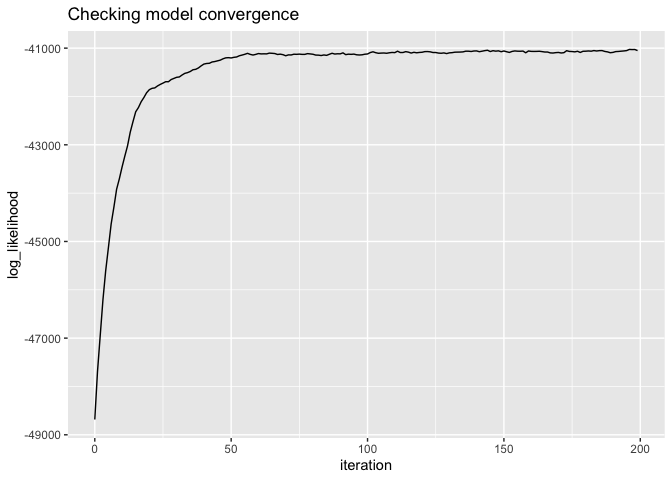
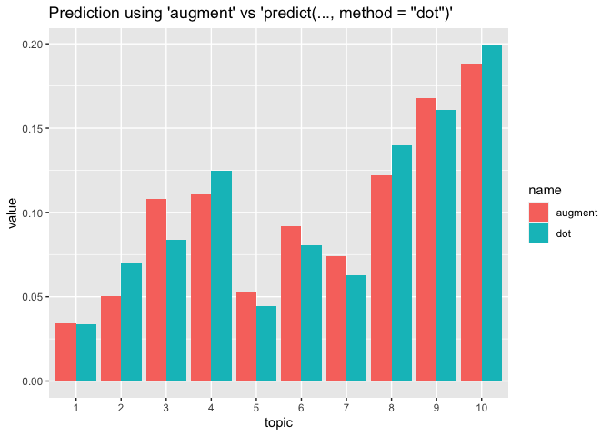

<!-- README.md is generated from README.Rmd. Please edit that file -->

# tidylda 

<!-- badges: start -->

[](https://ci.appveyor.com/project/TommyJones/tidylda)
[](https://codecov.io/gh/tommyjones/tidylda/branch/main)
[](https://lifecycle.r-lib.org/articles/stages.html#experimental)
[](https://github.com/tommyjones/tidylda/actions)
<!-- badges: end -->

Latent Dirichlet Allocation Using ‘tidyverse’ Conventions

`tidylda` implements an algorithm for Latent Dirichlet Allocation using
style conventions from the [tidyverse](https://style.tidyverse.org/) and
[tidymodels](https://tidymodels.github.io/model-implementation-principles/).

In addition this implementation of LDA allows you to:

-   use asymmetric prior parameters alpha and eta
-   use a matrix prior parameter, eta, to seed topics into a model
-   use a previously-trained model as a prior for a new model
-   apply LDA in a transfer-learning paradigm, updating a model’s
    parameters with additional data (or additional iterations)

Note that the seeding of topics and transfer learning are
**experimental** for now. They are almost-surely useful but their
behaviors have not been optimized or well-studied. Caveat emptor!

## Installation

You can install the development version from
[GitHub](https://github.com/) with:

``` r
install.packages("remotes")

remotes::install_github("tommyjones/tidylda")
```

# Getting started

This package is still in its early stages of development. However, some
basic functionality is below. Here, we will use the `tidytext` package
to create a document term matrix, fit a topic model, predict topics of
unseen documents, and update the model with those new documents.

`tidylda` uses the following naming conventions for topic models:

-   `theta` is a matrix whose rows are distributions of topics over
    documents, or P(topic\|document)
-   `beta` is a matrix whose rows are distributions of tokens over
    topics, or P(token\|topic)
-   `lambda` is a matrix whose rows are distributions of topics over
    tokens, or P(topic\|token) `lambda` is useful for making predictions
    with a computationally-simple and efficient dot product and it may
    be interesting to analyze in its own right.
-   `alpha` is the prior that tunes `theta`
-   `eta` is the prior that tunes `beta`

## Example

``` r
library(tidytext)
library(tidyverse)
#> ── Attaching packages ─────────────────────────────────────── tidyverse 1.3.1 ──
#> ✓ ggplot2 3.3.5     ✓ purrr   0.3.4
#> ✓ tibble  3.1.5     ✓ dplyr   1.0.7
#> ✓ tidyr   1.1.4     ✓ stringr 1.4.0
#> ✓ readr   2.0.1     ✓ forcats 0.5.1
#> ── Conflicts ────────────────────────────────────────── tidyverse_conflicts() ──
#> x dplyr::filter() masks stats::filter()
#> x dplyr::lag()    masks stats::lag()
library(tidylda)
#> tidylda is under active development. The API and behavior may change.
library(Matrix)
#> 
#> Attaching package: 'Matrix'
#> The following objects are masked from 'package:tidyr':
#> 
#>     expand, pack, unpack
### Initial set up ---
# load some documents
docs <- textmineR::nih_sample 

# tokenize using tidytext's unnest_tokens
tidy_docs <- docs %>% 
  select(APPLICATION_ID, ABSTRACT_TEXT) %>% 
  unnest_tokens(output = word, 
                input = ABSTRACT_TEXT,
                stopwords = stop_words$word,
                token = "ngrams",
                n_min = 1, n = 2) %>% 
  count(APPLICATION_ID, word) %>% 
  filter(n>1) #Filtering for words/bigrams per document, rather than per corpus

tidy_docs <- tidy_docs %>% # filter words that are just numbers
  filter(! stringr::str_detect(tidy_docs$word, "^[0-9]+$"))

# append observation level data 
colnames(tidy_docs)[1:2] <- c("document", "term")


# turn a tidy tbl into a sparse dgCMatrix 
# note tidylda has support for several document term matrix formats
d <- tidy_docs %>% 
  cast_sparse(document, term, n)

# let's split the documents into two groups to demonstrate predictions and updates
d1 <- d[1:50, ]

d2 <- d[51:nrow(d), ]

# make sure we have different vocabulary for each data set to simulate the "real world"
# where you get new tokens coming in over time
d1 <- d1[, colSums(d1) > 0]

d2 <- d2[, colSums(d2) > 0]

### fit an intial model and inspect it ----

set.seed(123)

lda <- tidylda(
  data = d1,
  k = 10,
  iterations = 200, 
  burnin = 175,
  alpha = 0.1, # also accepts vector inputs
  eta = 0.05, # also accepts vector or matrix inputs
  optimize_alpha = FALSE, # experimental
  calc_likelihood = TRUE,
  calc_r2 = TRUE, # see https://arxiv.org/abs/1911.11061
  return_data = FALSE
)

# did the model converge?
# there are actual test stats for this, but should look like "yes"
qplot(x = iteration, y = log_likelihood, data = lda$log_likelihood, geom = "line") + 
    ggtitle("Checking model convergence")
```



``` r
# look at the model overall
glance(lda)
#> # A tibble: 1 × 5
#>   num_topics num_documents num_tokens iterations burnin
#>        <int>         <int>      <int>      <dbl>  <dbl>
#> 1         10            50       1524        200    175
print(lda)
#> A Latent Dirichlet Allocation Model of  10 topics,  50  documents, and  1524  tokens:
#> tidylda(data = d1, k = 10, iterations = 200, burnin = 175, alpha = 0.1, 
#>     eta = 0.05, optimize_alpha = FALSE, calc_likelihood = TRUE, 
#>     calc_r2 = TRUE, return_data = FALSE)
#> 
#> The model's R-squared is  0.2677 
#> The  5  most prevalent topics are:
#> # A tibble: 10 × 4
#>   topic prevalence coherence top_terms                              
#>   <dbl>      <dbl>     <dbl> <chr>                                  
#> 1     7       11.9     0.140 cancer, dcis, cells, ...               
#> 2     1       11.0     0.22  cdk5, effects, v4, ...                 
#> 3     6       10.9     0.295 sud, risk, factors, ...                
#> 4    10       10.8     0.303 mitochondrial, plasticity, studies, ...
#> 5     3       10.5     0.248 sleep, cell, lung, ...                 
#> # … with 5 more rows
#> 
#> The  5  most coherent topics are:
#> # A tibble: 10 × 4
#>   topic prevalence coherence top_terms                              
#>   <dbl>      <dbl>     <dbl> <chr>                                  
#> 1     9      10.2      0.509 diabetes, numeracy, data, ...          
#> 2     8       8.83     0.494 function, cmybp, injury, ...           
#> 3    10      10.8      0.303 mitochondrial, plasticity, studies, ...
#> 4     6      10.9      0.295 sud, risk, factors, ...                
#> 5     5       8.06     0.258 research, disparities, program, ...    
#> # … with 5 more rows
# it comes with its own summary matrix that's printed out with print(), above
lda$summary
#> # A tibble: 10 × 4
#>    topic prevalence coherence top_terms                              
#>    <dbl>      <dbl>     <dbl> <chr>                                  
#>  1     1      11.0      0.22  cdk5, effects, v4, ...                 
#>  2     2       8.07     0.18  research, responses, antibodies, ...   
#>  3     3      10.5      0.248 sleep, cell, lung, ...                 
#>  4     4       9.76     0.145 cns, cells, brain, ...                 
#>  5     5       8.06     0.258 research, disparities, program, ...    
#>  6     6      10.9      0.295 sud, risk, factors, ...                
#>  7     7      11.9      0.140 cancer, dcis, cells, ...               
#>  8     8       8.83     0.494 function, cmybp, injury, ...           
#>  9     9      10.2      0.509 diabetes, numeracy, data, ...          
#> 10    10      10.8      0.303 mitochondrial, plasticity, studies, ...
# inspect the individual matrices
tidy_theta <- tidy(lda, matrix = "theta")

tidy_theta
#> # A tibble: 500 × 3
#>    document topic   theta
#>    <chr>    <dbl>   <dbl>
#>  1 8574224      1 0.00238
#>  2 8574224      2 0.00238
#>  3 8574224      3 0.00238
#>  4 8574224      4 0.00238
#>  5 8574224      5 0.00238
#>  6 8574224      6 0.976  
#>  7 8574224      7 0.00333
#>  8 8574224      8 0.00238
#>  9 8574224      9 0.00429
#> 10 8574224     10 0.00238
#> # … with 490 more rows
tidy_beta <- tidy(lda, matrix = "beta")

tidy_beta
#> # A tibble: 15,240 × 3
#>    topic token             beta
#>    <dbl> <chr>            <dbl>
#>  1     1 adolescence  0.0000673
#>  2     1 age          0.0000673
#>  3     1 application  0.0000673
#>  4     1 depressive   0.0000673
#>  5     1 disorder     0.0000673
#>  6     1 emotionality 0.0000673
#>  7     1 information  0.00276  
#>  8     1 mdd          0.0000673
#>  9     1 onset        0.0000673
#> 10     1 onset mdd    0.0000673
#> # … with 15,230 more rows
tidy_lambda <- tidy(lda, matrix = "lambda")

tidy_lambda
#> # A tibble: 15,240 × 3
#>    topic token         lambda
#>    <dbl> <chr>          <dbl>
#>  1     1 adolescence  0.00780
#>  2     1 age          0.00912
#>  3     1 application  0.00780
#>  4     1 depressive   0.0201 
#>  5     1 disorder     0.0201 
#>  6     1 emotionality 0.0201 
#>  7     1 information  0.273  
#>  8     1 mdd          0.0111 
#>  9     1 onset        0.00773
#> 10     1 onset mdd    0.0201 
#> # … with 15,230 more rows
# append observation-level data
augmented_docs <- augment(lda, data = tidy_docs)

augmented_docs
#> # A tibble: 4,566 × 3
#>    document term         topic
#>    <chr>    <chr>        <int>
#>  1 8574224  adolescence      6
#>  2 8574224  age              6
#>  3 8574224  application      6
#>  4 8574224  depressive       6
#>  5 8574224  disorder         6
#>  6 8574224  emotionality     6
#>  7 8574224  information      7
#>  8 8574224  mdd              6
#>  9 8574224  onset            6
#> 10 8574224  onset mdd        6
#> # … with 4,556 more rows
### predictions on held out data ---
# two methods: gibbs is cleaner and more techically correct in the bayesian sense
p_gibbs <- predict(lda, new_data = d2[1, ], iterations = 100, burnin = 75)

# dot is faster, less prone to error (e.g. underflow), noisier, and frequentist
p_dot <- predict(lda, new_data = d2[1, ], method = "dot")

# pull both together into a plot to compare
tibble(topic = 1:ncol(p_gibbs), gibbs = p_gibbs[1,], dot = p_dot[1, ]) %>%
  pivot_longer(cols = gibbs:dot, names_to = "type") %>%
  ggplot() + 
  geom_bar(mapping = aes(x = topic, y = value, group = type, fill = type), 
           stat = "identity", position="dodge") +
  scale_x_continuous(breaks = 1:10, labels = 1:10) + 
  ggtitle("Gibbs predictions vs. dot product predictions")
```


``` r
### Augment as an implicit prediction using the 'dot' method ----
# Aggregating over terms results in a distribution of topics over documents
# roughly equivalent to using the "dot" method of predictions.
augment_predict <- 
  augment(lda, tidy_docs, "prob") %>%
  group_by(document) %>% 
  select(-c(document, term)) %>% 
  summarise_all(function(x) sum(x, na.rm = T))
#> Adding missing grouping variables: `document`
# reformat for easy plotting
augment_predict <- 
  as_tibble(t(augment_predict[, -1]))
#> Warning: The `x` argument of `as_tibble.matrix()` must have unique column names if `.name_repair` is omitted as of tibble 2.0.0.
#> Using compatibility `.name_repair`.
#> This warning is displayed once every 8 hours.
#> Call `lifecycle::last_lifecycle_warnings()` to see where this warning was generated.
colnames(augment_predict) <- unique(tidy_docs$document)

augment_predict$topic <- 1:nrow(augment_predict) %>% as.factor()

compare_mat <- 
  augment_predict %>%
  select(
    topic,
    augment = matches(rownames(d2)[1])
  ) %>%
  mutate(
    augment = augment / sum(augment), # normalize to sum to 1
    dot = p_dot[1, ]
  ) %>%
  pivot_longer(cols = c(augment, dot))

ggplot(compare_mat) + 
  geom_bar(aes(y = value, x = topic, group = name, fill = name), 
           stat = "identity", position = "dodge") +
  labs(title = "Prediction using 'augment' vs 'predict(..., method = \"dot\")'")
```



``` r
# Not shown: aggregating over documents results in recovering the "tidy" lambda.

### updating the model ----
# now that you have new documents, maybe you want to fold them into the model?
lda2 <- refit(
  object = lda, 
  new_data = d, # save me the trouble of manually-combining these by just using d
  iterations = 200, 
  burnin = 175,
  calc_likelihood = TRUE,
  calc_r2 = TRUE
)

# we can do similar analyses
# did the model converge?
qplot(x = iteration, y = log_likelihood, data = lda2$log_likelihood, geom = "line") +
  ggtitle("Checking model convergence")
```


``` r
# look at the model overall
glance(lda2)
#> # A tibble: 1 × 5
#>   num_topics num_documents num_tokens iterations burnin
#>        <int>         <int>      <int>      <dbl>  <dbl>
#> 1         10            99       2962        200    175
print(lda2)
#> A Latent Dirichlet Allocation Model of  10 topics,  99  documents, and  2962  tokens:
#> refit.tidylda(object = lda, new_data = d, iterations = 200, burnin = 175, 
#>     calc_likelihood = TRUE, calc_r2 = TRUE)
#> 
#> The model's R-squared is  0.1478 
#> The  5  most prevalent topics are:
#> # A tibble: 10 × 4
#>   topic prevalence coherence top_terms                     
#>   <dbl>      <dbl>     <dbl> <chr>                         
#> 1     5      14.0     0.148  research, program, cancer, ...
#> 2     9      12.2     0.0532 data, health, diabetes, ...   
#> 3     2      11.5     0.0739 core, research, response, ... 
#> 4     6      11.0     0.163  risk, factors, clinical, ...  
#> 5     7       9.92    0.217  cancer, tumor, treatment, ... 
#> # … with 5 more rows
#> 
#> The  5  most coherent topics are:
#> # A tibble: 10 × 4
#>   topic prevalence coherence top_terms                              
#>   <dbl>      <dbl>     <dbl> <chr>                                  
#> 1     8       7.74     0.423 injury, function, cmybp, ...           
#> 2    10       6.09     0.320 mitochondrial, plasticity, studies, ...
#> 3     7       9.92     0.217 cancer, tumor, treatment, ...          
#> 4     4       9.2      0.171 cns, cell, cells, ...                  
#> 5     6      11.0      0.163 risk, factors, clinical, ...           
#> # … with 5 more rows
# how does that compare to the old model?
print(lda)
#> A Latent Dirichlet Allocation Model of  10 topics,  50  documents, and  1524  tokens:
#> tidylda(data = d1, k = 10, iterations = 200, burnin = 175, alpha = 0.1, 
#>     eta = 0.05, optimize_alpha = FALSE, calc_likelihood = TRUE, 
#>     calc_r2 = TRUE, return_data = FALSE)
#> 
#> The model's R-squared is  0.2677 
#> The  5  most prevalent topics are:
#> # A tibble: 10 × 4
#>   topic prevalence coherence top_terms                              
#>   <dbl>      <dbl>     <dbl> <chr>                                  
#> 1     7       11.9     0.140 cancer, dcis, cells, ...               
#> 2     1       11.0     0.22  cdk5, effects, v4, ...                 
#> 3     6       10.9     0.295 sud, risk, factors, ...                
#> 4    10       10.8     0.303 mitochondrial, plasticity, studies, ...
#> 5     3       10.5     0.248 sleep, cell, lung, ...                 
#> # … with 5 more rows
#> 
#> The  5  most coherent topics are:
#> # A tibble: 10 × 4
#>   topic prevalence coherence top_terms                              
#>   <dbl>      <dbl>     <dbl> <chr>                                  
#> 1     9      10.2      0.509 diabetes, numeracy, data, ...          
#> 2     8       8.83     0.494 function, cmybp, injury, ...           
#> 3    10      10.8      0.303 mitochondrial, plasticity, studies, ...
#> 4     6      10.9      0.295 sud, risk, factors, ...                
#> 5     5       8.06     0.258 research, disparities, program, ...    
#> # … with 5 more rows
```

I plan to have more analyses and a fuller accounting of the options of
the various functions when I write the vignettes.

See the “Issues” tab on GitHub to see planned features as well as bug
fixes.

If you have any suggestions for additional functionality, changes to
functionality, changes to arguments or other aspects of the API please
let me know by opening an issue on GitHub or sending me an email:
jones.thos.w at gmail.com.
